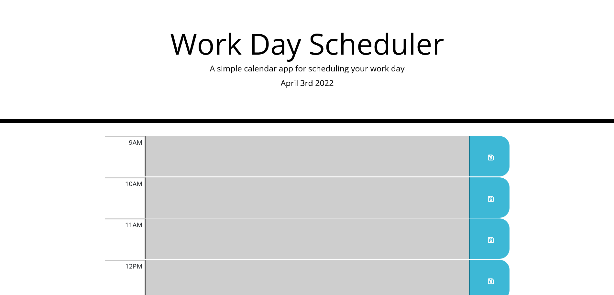

# Work Day Scheduler

### Front End Web App

## Description

Work Day Scheduler is a very basic app that helps you keep track of your day's schedule.

## Table of Contents

- [Usage](#usage)
- [License](#license)
- [Author](#author)
- [Badges](#badges)

## Usage

To use work day schedule click [here](https://d-whipp.github.io/work-day-scheduler/) and you'll be taken to the website. Once there you can enter information you'd like to keep track of for the day.  
This app still needs some work, namely to persist data past a page refresh.

## License

MIT License

Copyright (c) [2022] [David Whipple]

Permission is hereby granted, free of charge, to any person obtaining a copy of this software and associated documentation files (the "Software"), to deal in the Software without restriction, including without limitation the rights to use, copy, modify, merge, publish, distribute, sublicense, and/or sell copies of the Software, and to permit persons to whom the Software is furnished to do so, subject to the following conditions:

The above copyright notice and this permission notice shall be included in all copies or substantial portions of the Software.

THE SOFTWARE IS PROVIDED "AS IS", WITHOUT WARRANTY OF ANY KIND, EXPRESS OR IMPLIED, INCLUDING BUT NOT LIMITED TO THE WARRANTIES OF MERCHANTABILITY, FITNESS FOR A PARTICULAR PURPOSE AND NONINFRINGEMENT. IN NO EVENT SHALL THE AUTHORS OR COPYRIGHT HOLDERS BE LIABLE FOR ANY CLAIM, DAMAGES OR OTHER LIABILITY, WHETHER IN AN ACTION OF CONTRACT, TORT OR OTHERWISE, ARISING FROM, OUT OF OR IN CONNECTION WITH THE SOFTWARE OR THE USE OR OTHER DEALINGS IN THE SOFTWARE.

## Author

Hello! My name is David. 
Email is dwhipp88@gmail.com.  
[LinkedIn](https://www.linkedin.com/in/david-w-079841213/)  
If you're interested in seeing more of my work then check out my [portfolio](http://mighty-brook-32674.herokuapp.com/) or you can view my [github](https://github.com/D-Whipp).

## Badges

